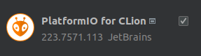
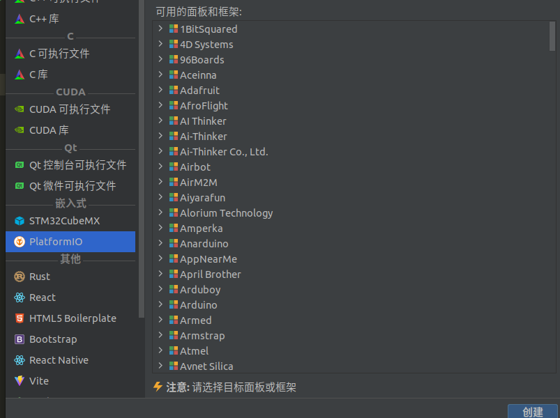
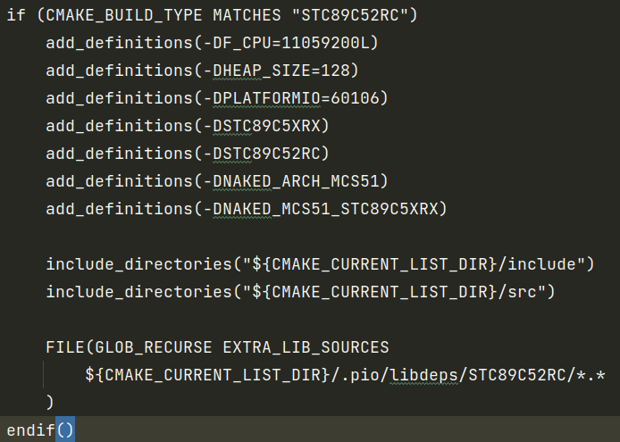
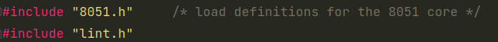
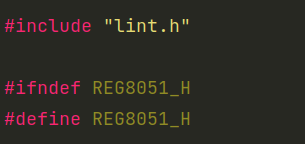

[TOC]

# 51开发
1. 安装插件

通过<https://raw.githubusercontent.com/platformio/platformio-core-installer/master/get-platformio.py>下载get-platformio.py文件后使用python运行
在设置->语言和框架中设置platformiod的路径，Windows和Linux稍有不同
Windows在C:/Users/UserName/.platformio/penv/Scripts/platformio
Linux在~/.platformio/penv/bin/platformio
官网链接：<https://docs.platformio.org/en/latest/core/installation/methods/index.html>
2. 安装Shell命令
- Windows在系统环境变量Path附加 C:\Users\UserName\.platformio\penv\Scripts
- Linux可通过在~/.profile中添加
```
export PATH=$PATH:$HOME/.local/bin
```
然后
```
ln -s ~/.platformio/penv/bin/platformio ~/.local/bin/platformio
ln -s ~/.platformio/penv/bin/pio ~/.local/bin/pio
ln -s ~/.platformio/penv/bin/piodebuggdb ~/.local/bin/piodebuggdb
```
或着直接
```
mkdir -p /usr/local/bin
ln -s ~/.platformio/penv/bin/platformio /usr/local/bin/platformio
ln -s ~/.platformio/penv/bin/pio /usr/local/bin/pio
ln -s ~/.platformio/penv/bin/piodebuggdb /usr/local/bin/piodebuggdb
```
官网链接：<https://docs.platformio.org/en/latest/core/installation/shell-commands.html#piocore-install-shell-commands>
3. 编写程序
- 选择芯片

以STC89C52为例
待环境构建完成后（第一次需下载文件有点慢）
在CMakeListsPrivate.txt文件中

Windows在include_directories后添加
```
include_directories("${ENV_HOME_PATH}/.platformio/packages/toolchain-sdcc/include")
include_directories("${ENV_HOME_PATH}/.platformio/packages/toolchain-sdcc/non-free/include")
```
Linux在include_directories后添加
```
include_directories("$ENV{HOME}/.platformio/packages/toolchain-sdcc/share/sdcc/include")
include_directories("$ENV{HOME}/.platformio/packages/toolchain-sdcc/share/sdcc/non-free/include")
```
跳转到8052.h头文件中，将#include <8051.h>改为#include "8051.h"并添加#include "lint.h"

跳转到8051.h头文件中，在开头添加上#include "8051.h"

然后可正常编写程序
注意，位定义和中断与keil不同
4. 烧录程序
platformio的烧录很慢，在platformio.ini添加
```
upload_flags =
    -P
    stc89a
    -p
    $UPLOAD_PORT
upload_command = stcgal $UPLOAD_FLAGS $SOURCE
```
可使用stcgal烧录程序
==重点！！！==
如果直接使用pip安装stcgal因为固件原因有部分stc89c52芯片不支持，在
https://github.com/nrife/stcgal.git 下载源码后Windows`python ./setup.py install`Linux`sudo ./setup.py install`安装stcgal，同时将stc89改为stc89a
#
