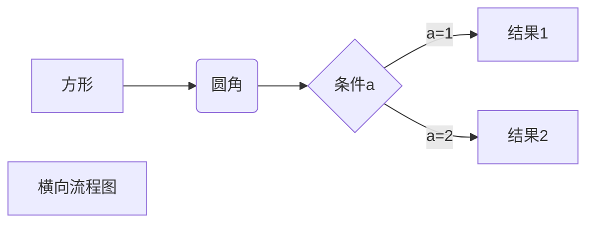
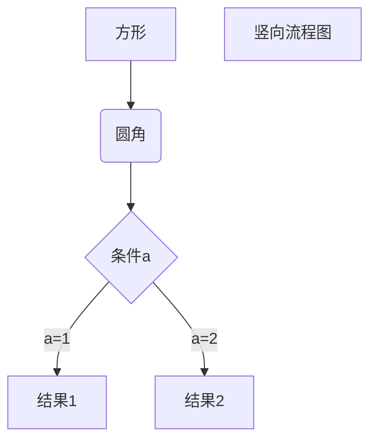
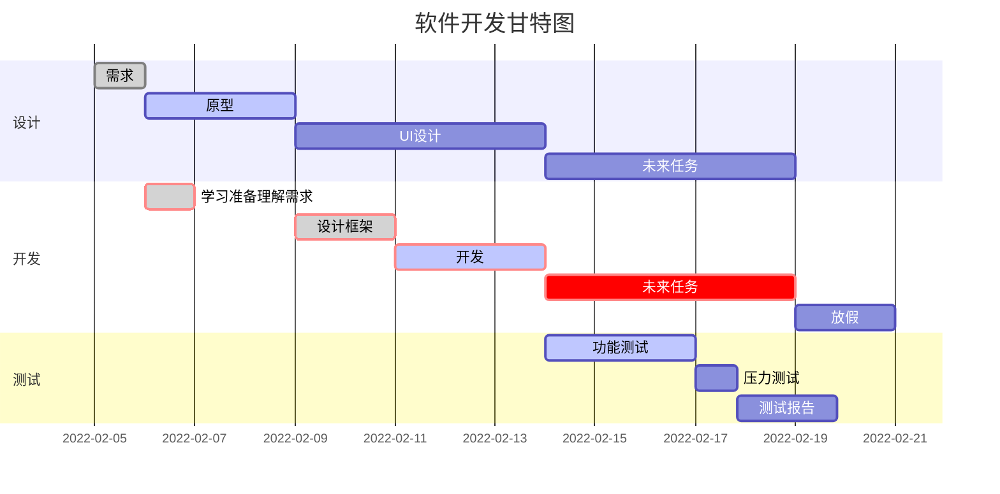

# 写在开头
本笔记通过根据VSCode安装插件来编写MarkDown文件进行总结

# 显示全文内容的目录结构
```
[TOC]
```
[TOC]

---

# 标题
```
# 一级标题
## 二级标题
### 三级标题
#### 四级标题
##### 五级标题
###### 六级标题
```
# 一级标题
## 二级标题
### 三级标题
#### 四级标题
##### 五级标题
###### 六级标题

# 段落
```
直接空一行
或者使用<br>
```
hello world<br>hello world

# 字体格式
```
*斜体文本*
_斜体文本_
**粗体文本**
__粗体文本__
***粗斜体文本***
___粗斜体文本___
==标记文本==
```
*斜体文本*
_斜体文本_
**粗体文本**
__粗体文本__
***粗斜体文本***
___粗斜体文本___
==标记文本==

# 字体字号颜色
```
采用HTML标签：<font>
font标签属性：
  face：字体
  size：规定文本的尺寸大小，从 1 到 7 的数字，浏览器默认值是 3。
  color: 颜色 十六进制颜色值或RGB值
```
```
<font face="STCAIYUN">华文彩云</font>
<font color=gray size=5>color=gray</font>
<font color=#0099ff size=5 face="黑体">color=#0099ff size=5 face="黑体"</font>
```
<font face="STCAIYUN">华文彩云</font>
<font color=gray size=5>color=gray</font>
<font color=#0099ff size=5 face="黑体">color=#0099ff size=5 face="黑体"</font>

# 对齐
```
采用HTML标签：<p>
p标签属性：
  align： 对齐方式
```
```
<p align="right">右对齐</p>
<p align="left">左对齐</p>
<p align="center">居中</p>
```
<p align="right">右对齐</p>
<p align="left">左对齐</p>
<p align="center">居中</p>

# 分割线
```
一行中用三个以上的* - _来建立分隔线，行内不能有其他文本，但是可以插入空格
```
```
***

* * *

*****

- - -

----------
```
***

* * *

*****

- - -

----------

# 删除线
```
~~要添加删除线的内容~~
通过HTML的标签<del>
```
~~要添加删除线的内容~~
<del>通过HTML的标签</del>

# 下划线
```
通过HTML的标签<u>
```
<u>通过HTML的标签</u>

# 列表
## 无序列表
```
使用* + -作为列表标记，标记后面要添加空格，再填写列表项
```
- Item 1
+ Item 2
  - Item 2a
  - Item 2b
* Item 3
  - Item 3a
    - Item 3a_1
    - Item 3b_1
## 有序列表
```
阿拉伯数字并加上. 
```
1. Item 1
1. Item 2
1. Item 3
   1. Item 3a
   1. Item 3b
## 列表嵌套
```
子列表中的选项前面添加Tab
```
1. 第一项：
   - 第一项嵌套的第一个元素
   - 第一项嵌套的第二个元素
2. 第二项：
   - 第二项嵌套的第一个元素
   - 第二项嵌套的第二个元素

# 任务列表
- [x] 在列表后加方括号
- [x] 完成项方括号中加'x'
- [ ] 未完成项方括号中间空出
1. [x] 支持 @提到，#引用，[链接]()，**格式**，<del>标签</del>

# 引用
> 段落开头使用'>'符号，然后后面紧跟一个空格符号
## 嵌套引用
> 最外层
> > 第一层嵌套
> > > 第二层嵌套
> 
> **引用里也可以使用MarkDown语法**

# 代码
## 单行代码
```
直接使用Tab或者使用`包裹代码语句
```
  std:cout << "Hello World" << std:endl;
`std:cout << "Hello World" << std:endl;`
## 代码块
```
用```包裹一段代码
```
## 语法高亮
```
用```包裹一段代码，并指定语言
```
``` C++
#include <iostream>

using namespace std:

void main()
{
    cout << "Hello World" << endl;
}
```
## 代码行数
```
用```包裹一段代码，并添加{.line-numbers}
```
``` {.line-numbers}
#include <iostream>

using namespace std:

void main()
{
    cout << "Hello World" << endl;
}
```
## 高亮代码行数
```C++ {highlight=10}
```

```C++ {highlight=10-20}
```

```C++ {highlight=[1-10,15,20-22]}
```

# 链接
```
[链接名称](链接地址)
<链接地址>
直接添加链接
```
(https://github.com)
<https://github.com>
https://github.com

# 图片
```


```


# 表格
```
使用'|'来分隔不同的单元格，使用'-'来分隔表头和其他行
:- 将表头及单元格内容左对齐
-: 将表头及单元格内容右对齐
:-: 将表头及单元格内容居中
```
| 项目        | 价格   |  数量  |
| --------   | -----:  | :----:  |
| 计算机     | \$1600 |   5     |
| 手机        |   \$12   |   12   |
| 管线        |    \$1    |  234  |

# 上标
```
X^Y^
```
X^Y^

# 下标
```
X~Y~
```
X~Y~

# 脚注
```
脚注自动被搬运到文章末尾，并且脚注后方的链接可以直接跳转回到加注的地方。
```
使用 Markdown[^1]可以效率的书写文档, 直接转换成 HTML[^2]
[^1]:Markdown是一种纯文本标记语言
[^2]:HyperText Markup Language 超文本标记语言

# 公式
## 单行公式
```
使用$包裹一行公式
```
$F(w)=\frac{1}{2\pi}\int_{-\infty}^\infty  f(t)e^{-iwt}\mathrm{d}t$
## 公式块
```
使用$$包裹一段公式
```
> <https://katex.org/docs/supported.html>

$$
\begin{matrix}
   a & b \\
   c & d
\end{matrix}
$$

# 支持的 HTML 元素
使用 <kbd>Ctrl</kbd>+<kbd>Alt</kbd>+<kbd>Del</kbd> 重启电脑

# 字符转义
```
显示特定符号则需要使用转义字符，MarkDown使用反斜杠转义
```
**文本加粗** 
\*\* 正常显示星号 \*\*

# 流程图
## 横向流程图

## 竖向流程图

## 标准流程图
```flow
st=>start: 开始框
op=>operation: 处理框
cond=>condition: 判断框(是或否?)
sub1=>subroutine: 子流程
io=>inputoutput: 输入输出框
e=>end: 结束框
st->op->cond
cond(yes)->io->e
cond(no)->sub1(right)->op
```
## 标准流程图（横向）
```flow
st=>start: 开始框
op=>operation: 处理框
cond=>condition: 判断框(是或否?)
sub1=>subroutine: 子流程
io=>inputoutput: 输入输出框
e=>end: 结束框
st(right)->op(right)->cond
cond(yes)->io(bottom)->e
cond(no)->sub1(right)->op
```
# 甘特图
