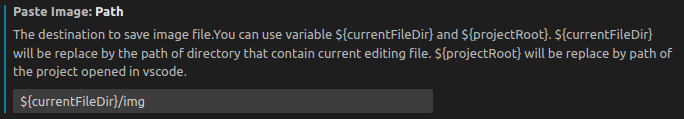

# #编写MarkDown
##需添加拓展
- Markdown All in One
- Markdown Preview Enhanced
  - 快捷键
    - 使用<kbd>Ctrl</kbd>+<kbd>K</kbd> V在当前页侧边打开预览
    - 使用<kbd>Ctrl</kbd>+<kbd>Shift</kbd>+<kbd>V</kbd> 在新页面打开预览
- Paste Image
  - 设置
    - 将Paste Image: Path改为${currentFileDir}/img，能够在当前 md文件目录中创建img文件夹来存放图片(使用<kbd>Ctrl</kbd>+<kbd>Alt</kbd>+<kbd>V</kbd>粘贴，linux需要安装xclip)
    
#
